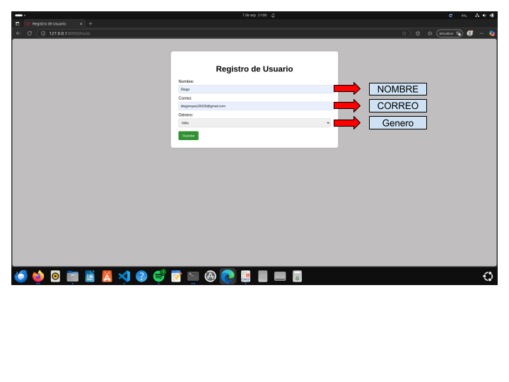

# Catálogo de Juguetes

## Introducción
Este proyecto es un pequeño portal web tipo catálogo de juguetes, desarrollado con Laravel y PHP.  
Permite a los usuarios registrarse proporcionando su nombre, correo y género, y luego navegar por un catálogo de juguetes recomendado según su género. Cada juguete tiene un botón “Enviar” que simula enviar la información del juguete al correo del usuario mediante logs.  

El proyecto utiliza:
- **Frontend:** HTML, CSS, JavaScript para interactividad.
- **Backend:** PHP con Laravel.
- **Base de datos:** MySQL (migraciones y seeders para datos de prueba).
- **Control de versiones:** Git.

---

## Instalación y configuración

1. **Clonar el repositorio:**
```bash
git clone https://github.com/Dreyes-hash/pruebaTecnicaHD.git
cd pruebaTecnicaHD
```

2. **Instalar dependencias con Composer:**
```bash
composer install
```

3. **Configurar archivo .env:**
```bash
cp .env.example .env
```
Ajusta los datos de conexión a la base de datos:
DB_CONNECTION=mysql
DB_HOST=127.0.0.1
DB_PORT=3306
DB_DATABASE=catalogo_juguetes
DB_USERNAME=usuario
DB_PASSWORD=contraseña

4. **Generar la key de la aplicación:**
```bash
php artisan key:generate
```

5. **Crear la base de datos y migrar las tablas:**
```bash
php artisan migrate
```

6. **Cargar datos de prueba:**
```bash
php artisan db:seed
```

7. **Ejecutar el servidor de desarrollo::**
```bash
php artisan 
```

---

## Análisis del proyecto

El análisis completo del proyecto, incluyendo requerimientos funcionales, diagramas de casos de uso y flujo de información, se encuentra en el archivo docs/analisis.md.
Puedes consultarlo aquí: https://github.com/Dreyes-hash/pruebaTecnicaHD/blob/main/docs/Analisis.md

---

## Capturas del funcionamiento

### Formulario de registro


### Catálogo de juguetes con saludo personalizado


### Ventana popup al enviar información del juguete


### Envio de correos al usuario
