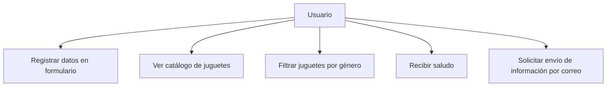
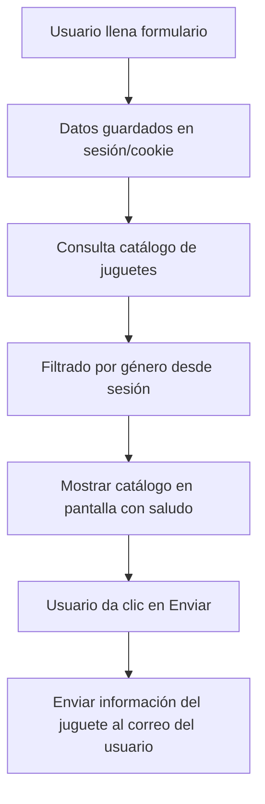

# Análisis inicial del Problema

## 1. Requerimientos funcionales

* El sistema debe permitir al usuario registrarse ingresando:
  - Nombre
  - Correo electrónico
  - Género
* El sistema debe almacenar los datos del usuario en sesión o cookie.
* El sistema debe mostrar un catálogo de juguetes.
* El catálogo debe filtrarse según el género del usuario.
* El sistema debe mostrar un saludo personalizado con el nombre del usuario.
* Cada juguete debe tener un botón **"Enviar"** que envíe la información del juguete al correo del cliente.
* El sistema debe contar con datos de prueba en la base de datos.

---

## 2. Diagrama de Casos de Uso

## 3. Flujo de la información

## 4. Modelado de la BD

Tabla Juguetes
| Campo       | Tipo                         | Restricciones              |
| ----------- | ---------------------------- | -------------------------- |
| id          | INT                          | PK, AUTO\_INCREMENT        |
| nombre      | VARCHAR(100)                 | NOT NULL                   |
| descripcion | TEXT                         | NULL                       |
| genero      | ENUM('M','F')                | NOT NULL                   |
| precio      | DECIMAL(10,2)                | NOT NULL                   |
| imagen      | VARCHAR(250)                 |                            |
